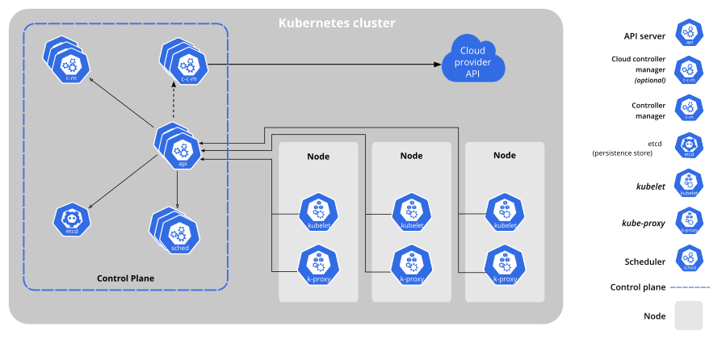
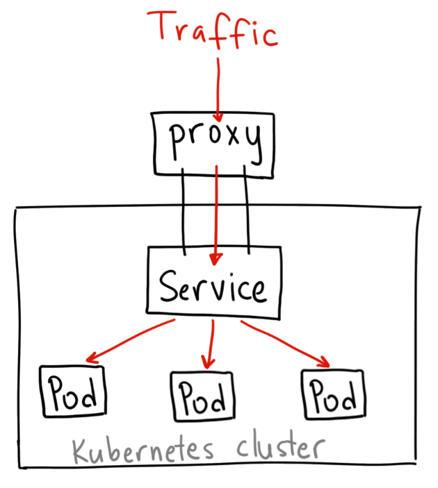
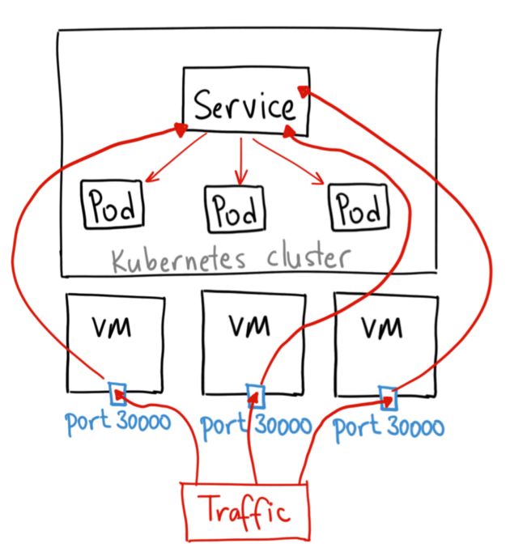
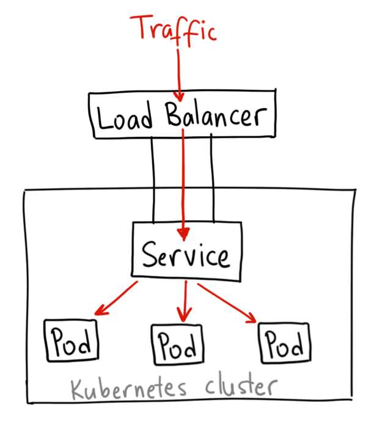
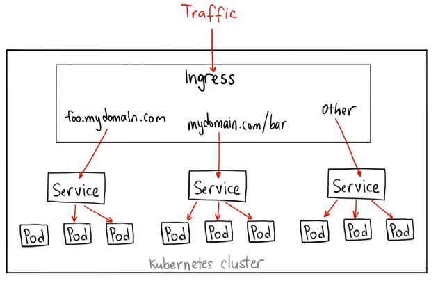

# Kubernetes
## Daftar Konten Pelatihan
1. Kubernetes & Container Orchestration
2. Komponen Kubernetes
    - Control Plane
    - Node
3. Cluster Networking
4. Addons

## Kubernetes & Container Orchestration

Kubernetes mengoordinasikan klaster komputer ketersediaan tinggi (_highly available_) yang saling terhubung sebagai unit tunggal. Abstraksi pada Kubernetes mengizinkan kamu untuk men-_deploy_ aplikasi terkemas (_containerized_) ke sebuah klaster tanpa perlu membalutnya secara spesifik pada setiap mesin. Untuk menggunakan model baru _deployment_ ini, aplikasi perlu dikemas dengan cara memisahkan mereka dari hos individu: mereka perlu dikemas. Aplikasi terkemas lebih fleksibel dan tersedia dibanding model _deployment_ lama, dimana aplikasi dipasang secara langsung didalam mesin spesifik sebagai paket yang sangat terintegrasi dengan hos. Kubernetes mengotomasisasikan distribusi dan penjadwalan kontainer aplikasi sebuah klaster secara menyeluruh dengan cara yang lebih efisien. Kubernetes merupakan platform _open-source_ dan siap produksi.

Klaster Kubernetes terdiri dari 2 tipe sumber daya:

- **Master** mengoordinasikan klaster
- **Node** adalah pekerja (_worker_) yang menjalankan aplikasi

### Diagram Klaster


Pada gambar diatas, terdapat beberapa bagian yang dapat diperhatikan.

**Master Node** mempunyai kewajiban untuk mengelola klaster. Master mengoordinasikan semua aktifitas di klaster kamu, seperti penjadwalan aplikasi, pemeliharaan keadaan (_state_) aplikasi yang diinginkan, _scaling_ aplikasi, dan _roll-out_ pembaharuan.Master mempunyai kewajiban untuk mengelola klaster. Master mengoordinasikan semua aktifitas di klaster kamu, seperti penjadwalan aplikasi, pemeliharaan keadaan (_state_) aplikasi yang diinginkan, _scaling_ aplikasi, dan _roll-out_ pembaharuan.

Komponen pada *master node* biasanya terdiri dari kube-apiserver, kube-controller-manager, kube-scheduler, dan etcd yang sering dikelompokkan menjadi satu istilah, yaitu **Control Plane**.

**Node** merupakan VM atau komputer fisik yang berfungsi sebagai mesin pekerja dalam klaster Kubernetes. Setiap node mempunyai Kubelet, sebuah agen untuk mengatur Node dan komunikasi dengan Kubernetes master. Node juga harus mempunyai alat untuk menangani operasi kontainer, seperti Docker atau rkt. Sebuah klaster Kubernetes yang menangani trafik produksi harus mempunyai minimal 3 Node.

### Tools for Provisioning K8s Cluster

Dalam melakukan *provisioning* atau pembuatan klaster K8s di server, kita dapat menggunakan tools yang direkomendasikan dari pihak kubernetes itu sendiri yaitu **kubeadm**. **Minikube** juga merupakan tools yang bagus untuk lingkungan percobaan dan pembelajaran karena proses pembuatannya yang sangat simple (Hanya butuh cukup 1 node saja), namun tidak direkomendasikan untuk produksi.

Terdapat pula Kubernetes Distribution yang merupakan versi kubernetes yang telah di "modifikasi" sesuai dengan siapa pihak atau provider yang merilis Distribution tersebut. Konsep ini mirip dengan konsep Distro pada Linux. Beberapa K8s Distro yang terkenal dan telah disertifikasi oleh CNCF adalah Rancher Kubernetes Engine (RKE), Amazon Elastic Kubernetes Service - Distro (EKS-D), k3s, k0s, MicroK8s, dll. Untuk lebih lengkapnya, bisa dilihat pada tautan [berikut](https://landscape.cncf.io/guide#platform--certified-kubernetes-distribution).

Pada modul ini, kita akan berfokus pada penggunaan distribution RKE karena memiliki komunitas yang luas dan sudah terbukti oleh beberapa perusahaan pada lingkungan produksi. Saat ini, RKE masih menggunakan Docker sebagai *container runtime*, di mana K8s sendiri akan menghentikan supportnya di beberapa rilis mendatang. Pastikan untuk selalu membaca dokumentasi official RKE untuk mengetahui perubahan dan pembaruan terkait tools ini.

## Komponen Kubernetes



Sebuah Klaster Kubernetes terdiri dari beberapa mesin *worker* yang disebut node yang menjalankan aplikasi terkontainerisasi. Setiap Klaster memiliki setidaknya 1 *worker*.

Node-node *worker* nantinya akan menjadi tempat untuk pod-pod yang merupakan komponen dari suatu aplikasi. Selain *worker* terdapat *Control Plane* yang mengatur *worker* dan *pod* dalam klaster. Pada lingkungan produksi, *control plane* biasanya berjalan pada banyak node dan menyediakan *fault-tolerance* dan ketersediaan tinggi terhadap klaster.

## Komponen Control Plane

Komponen *control plane* berguna untuk membuat keputusan dalam klaster tersebut (contohnya, mekanisme penjadwalan pod atau objek lain), serta berperan dalam deteksi dan merespon terhadap *events* dalam klaster (contohnya, penjadwalan pod baru apabila jumlah replika yang ada pada replication controller tidak terpenuhi).

Control plane dapat dijalankan di mesin atau node manapun yang ada di klaster. Namun biasanya, untuk memudahkan proses awal, skrip awal biasanya memulai semua komponen *control plane* pada mesin yang sama dan tidak menjalankan kontainer *user* pada mesin ini. Untuk pembuatan cluster HA, disarankan untuk menjalankan *control plane* pada banyak mesin (minimal 3).

### kube-apiserver

Komponen control plane yang mengekspos API Kubernetes. Merupakan front-end dari control plane Kubernetes.

### etcd

Penyimpanan atau *database key value* konsisten yang digunakan sebagai penyimpanan data klaster Kubernetes. Selalu perhatikan mekanisme untuk mencadangkan data etcd pada klaster Kubernetes, etcd adalah komponen yang wajib untuk dicadangkan.

### kube-scheduler

Komponen *control plane* yang bertugas mengamati Pod baru yang belum ditempatkan di node manapun dan kemudian memilihkan Node di mana Pod baru tersebut akan dijalankan (penjadwalan).

Faktor-faktor yang dipertimbangkan untuk keputusan penjadwalan termasuk: kebutuhan sumber daya secara individual dan kolektif, batasan perangkat keras/perangkat lunak/peraturan, spesifikasi afinitas dan nonafinitas, lokalisasi data, interferensi antar beban kerja dan tenggat waktu.

### kube-controller-manager

Komponen control plane yang menjalankan pengontrol.

Secara logis, setiap pengontrol adalah sebuah proses yang berbeda, tetapi untuk mengurangi kompleksitas, kesemuanya dikompilasi menjadi sebuah *binary* yang dijalankan sebagai satu proses.

Kontroler-kontroler ini meliputi:

- Kontroler *Node* : Bertanggung jawab untuk mengamati dan memberikan respons apabila jumlah *node* berkurang.
- Kontroler Replikasi : Bertanggung jawab untuk menjaga jumlah *pod* agar jumlahnya sesuai dengan kebutuhan setiap objek kontroler replikasi yang ada di sistem.
- Kontroler *Endpoints* : Menginisiasi objek *Endpoints* (yang merupakan gabungan *Pods* dan *Services*).
- Kontroler *Service Account & Token*: Membuat akun dan akses token API standar untuk setiap *namespaces* yang dibuat.

### cloud-controller-manager

[Cloud-controller-manager](https://kubernetes.io/docs/concepts/architecture/cloud-controller/) merupakan kontroler yang berinteraksi dengan penyedia layanan *cloud*. Kontroler ini merupakat fitur alfa yang diperkenalkan pada Kubernetes versi 1.6. Untuk info lebih lanjut, bisa dibaca pada tautan [berikut](https://kubernetes.io/docs/concepts/architecture/cloud-controller/).

## Komponen Node

Komponen ini ada pada setiap *node*, fungsinya adalah melakukan pemeliharaan terhadap *pod* serta menyediakan *environment runtime* bagi Kubernetes.

### kubelet

Agen yang dijalankan pada setiap node di klaster yang bertugas untuk memastikan kontainer dijalankan di dalam Pod.

### kube-proxy

[kube-proxy](https://kubernetes.io/docs/admin/kube-proxy/) membantu abstraksi service Kubernetes melakukan tugasnya. Hal ini terjadi dengan cara memelihara aturan-aturan jaringan (network rules) serta meneruskan koneksi yang ditujukan pada suatu host.

### Container Runtime

*Container runtime* adalah perangkat lunak yang bertanggung jawab dalam menjalankan kontainer. Kubernetes mendukung beberapa *runtime*, diantaranya adalah: [Docker](http://www.docker.com), [containerd](https://containerd.io), [cri-o](https://cri-o.io/), [rktlet](https://github.com/kubernetes-incubator/rktlet) dan semua implementasi [Kubernetes CRI (Container Runtime Interface)](https://github.com/kubernetes/community/blob/master/contributors/devel/sig-node/container-runtime-interface.md).

## Cluster Networking

Jaringan adalah bagian utama dari Kubernetes, tetapi bisa menjadi sulit untuk memahami persis bagaimana mengharapkannya bisa bekerja. Ada 4 masalah yang berbeda untuk diatasi:

1. Komunikasi antar kontainer yang sangat erat: hal ini diselesaikan oleh Pod dan komunikasi `localhost`.
2. Komunikasi antar Pod: ini adalah fokus utama dari dokumen ini.
3. Komunikasi Pod dengan Service: ini terdapat di Service.
4. Komunikasi eksternal dengan Service: ini terdapat di Service.

Kubernetes adalah tentang berbagi mesin antar aplikasi. Pada dasarnya, saat berbagi mesin harus memastikan bahwa dua aplikasi tidak mencoba menggunakan port yang sama. Mengkoordinasikan port di banyak pengembang sangat sulit dilakukan pada skala yang berbeda dan memaparkan pengguna ke masalah tingkat kluster yang di luar kendali mereka.

Alokasi port yang dinamis membawa banyak komplikasi ke sistem - setiap aplikasi harus menganggap port sebagai flag, server API harus tahu cara memasukkan nomor port dinamis ke dalam blok konfigurasi, Service-Service harus tahu cara menemukan satu sama lain, dll. Sebaliknya daripada berurusan dengan ini, Kubernetes mengambil pendekatan yang berbeda.

Kubernetes memiliki ekspektasi bahwa konfigurasi jaringan untuk komunikasi antar pod telah tersedia dan tidak akan membuatnya sendiri. Untuk menyediakan jaringan container, Kubernetes melakukan standarisasi pada spesifikasi Container Network Interface (CNI). Sejak v1.6.0, tujuan adanya tools kubeadm (alat bootstrap cluster Kubernetes) adalah menggunakan CNI. Informasi lebih lanjut mengenai Jaringan pada Kubernetes dapat anda lihat pada tautan [berikut](https://speakerdeck.com/thockin/illustrated-guide-to-kubernetes-networking) atau [dokumentasi](https://kubernetes.io/docs/concepts/cluster-administration/networking/) official dari kubernetes.

## Addons

*Addons* merupakan pod dan service yang mengimplementasikan fitur-fitur yang diperlukan klaster.

Beberapa *addons* akan dijelaskan selanjutnya.

### DNS

Meskipun tidak semua *addons* dibutuhkan, semua klaster Kubernetes hendaknya memiliki DNS klaster. Komponen ini penting karena banyak dibutuhkan oleh komponen lainnya.

[Klaster DNS](https://kubernetes.io/docs/concepts/cluster-administration/addons/) adalah server DNS, selain beberapa server DNS lain yang sudah ada di *environment* kamu, yang berfungsi sebagai catatan DNS bagi Kubernetes *services*

Kontainer yang dimulai oleh kubernetes secara otomatis akan memasukkan server DNS ini ke dalam mekanisme pencarian DNS yang dimilikinya.

### Web UI (Dasbor)

[Dasbor](https://kubernetes.io/docs/tasks/access-application-cluster/web-ui-dashboard/) adalah antar muka berbasis web multifungsi yang ada pada klaster Kubernetes. Dasbor ini memungkinkan user melakukan manajemen dan *troubleshooting* klaster maupun aplikasi yang ada pada klaster itu sendiri.

### Container Resource Monitoring

[Container Resource Monitoring](https://kubernetes.io/docs/tasks/debug-application-cluster/resource-usage-monitoring/) mencatat metrik *time-series* yang diperoleh dari kontainer ke dalam basis data serta menyediakan antar muka yang dapat digunakan untuk melakukan pencarian data yang dibutuhkan.

### Cluster-level Logging

[Cluster-level logging](https://kubernetes.io/docs/concepts/cluster-administration/logging/) bertanggung jawab mencatat *log* kontainer pada penyimpanan *log* terpusat dengan antar muka yang dapat digunakan untuk melakukan
pencarian.

## Membangun Cluster Kubernetes Lokal dengan k3d

k3d memungkinkan kita untuk membangun kluster Kubernetes berbasis k3s baik single maupun multi node. Node pada kluster k3d diimplementasikan dalam kontainer sehingga membutuhkan sumber daya komputasi yang lebih rendah daripada yang berbasis mesin virtual. 

Untuk membuat kluster k3d, kita dapat menjalankan perintah berikut

```
k3d cluster create -p port_mapping -a jumlah_node
```

- -p : mapping port dari kluster k3d ke host
- -a : jumlah node yang akan dibuat

Sebagai contoh, untuk menjalankan kluster k3d dengan 3 worker node dan mapping dari port 30001 di kluster ke port 8082 di host, kita dapat menjalankan perintah berikut. 

```
k3d cluster create -p "8082:30001@loadbalancer" -a 3
```

## Manajemen Pod

Pod merupakan unit atomik eksekusi di Kubernetes. Dalam satu pod terdapat minimal satu kontainer walaupun dimungkinkan dalam satu pod terdapat multi kontainer. Kontainer-kontainer dalam satu pod berbagi network, port, dan domain namespace yang sama.

Pod dikelola dengan menggunakan file manifest. Berikut contoh file manifest untuk pod.
```
apiVersion: v1 
kind: Pod 
metadata:
  name: hello-pod 
  labels:
    zone: prod
    version: v1 
spec:
  containers:
    - name: hello-web
      image: nginx:alpine 
      ports:
      - containerPort: 80
```

Beberapa perintah penting untuk manajemen pod.
- Menjalankan pod
    ```
    kubectl apply -f pod-manifest.yml
    ```
- Menghapus pod
    ```
    kubectl delete -f pod-manifest.yml
    ```
- Menampilkan daftar pod
    ```
    kubectl get pods
    ```
- Melihat detail informasi sebuah pod
    ```
    kubectl get pods pod-name -o yaml
    ```
## Manajemen Deployment


Deployment memungkinkan adanya mekanisme self-healing, skalabilitas, rolling update dan versioning dalam pengelolaan pod. Sebagai contoh, pada Deployment, kita bisa mendefinisikan berapa jumlah replika pod yang diinginkan. Deployment akan berusaha untuk membuat agar kondisi kluster saat ini (current state) sama dengan kondisi kluster yang diinginkan (desired state). Sebagai contoh, jika dalam manifest kita mendefinisikan 2 replika sementara yang berjalan hanya 1, maka Deployment akan mencoba untuk menjalankan 1 replika baru.

Deployment dikelola dengan menggunakan file manifest. Berikut contoh file manifest untuk Deployment.
```
apiVersion: apps/v1
kind: Deployment
metadata:
  name: hello-world
spec:
  selector:
    matchLabels:
      app: hello-world
  replicas: 2
  template:
    metadata:
      labels:
        app: hello-world
    spec:
      containers:
      - name: hello-web
        image: nginx:alpine 
        ports:
        - containerPort: 80
```

Beberapa perintah penting untuk manajemen pod.

- Menjalankan deployment

    ```bash
    kubectl apply -f deployment-manifest.yml
    ```

- Menghapus deployment

    ```bash
    kubectl delete -f deployment-manifest.yml
    ```
- Menampilkan daftar deployment

    ```bash
    kubectl get deploy
    ```

- Melihat detail informasi sebuah deployment

    ```bash
    kubectl describe deploy deploy-name
    ```

## Manajemen Service


Pod yang dikelola oleh Deployment bisa mati dan dibuat kembali bergantung dengan desired dan current state. Pod yang dibuat kembali merupakan instance yang berbeda dengan pod yang mati. Sebagai konsekuensinya, pod tersebut bisa memiliki alamat IP internal yang berbeda. Oleh karena itu, untuk dapat mengakses layanan dalam pod dengan abstraksi IP yang tetap, maka kita memerlukan komponen Kubernetes yang disebut **Service**.

Service dikelola dengan menggunakan file manifest. Berikut contoh file manifest untuk Service berjenis **NodePort** yang memetakan port 80 pada kontainer/pod ke port 30001 yang bisa diakses dari luar pod.
```
apiVersion: v1 
kind: Service 
metadata:
  name: hello-nodeport
spec:
  type: NodePort
  ports:
    - port: 80
      nodePort: 30001
      protocol: TCP
  selector:
    app: hello-world
```

Beberapa perintah penting untuk manajemen pod.

- Menjalankan service

    ```bash
    kubectl apply -f service-manifest.yml
    ```

- Menghapus service

    ```bash
    kubectl delete -f service-manifest.yml
    ```

- Menampilkan daftar service

    ```bash
    kubectl get service
    ```

- Melihat detail informasi sebuah service

    ```bash
    kubectl describe service service-name
    ```

## Ekspos Layanan Pod

Setiap Pod memiliki alamat IP lokal yang hanya bisa diakses oleh kontainer yang berada pada kluster yang sama. Agar sebuah layanan yang di-deploy dalam pod dapat diakses dari luar kluster, maka diperlukan mekanisme ekspos layanan menggunakan komponen **Service**. 

Terdapat beberapa strategi untuk ekspos layanan, antara lain : Cluster IP, Ingress, Node Port dan Load Balancer.

### Cluster IP



Ketika menggunakan service dengan tipe cluster IP, normalnya kita tidak bisa mengaksesnya secara langsung. Hal ini disebabkan dikarenakan pada service tersebut akan diberkan IP lokal dari cluster tersebut dan tidak dapat diakses sama sekali dari luar cluster. Namun, kita bisa menggunakan `kube-proxy` untuk mengaksesnya. Tentu saja, hal ini tidak direkomendasikan untuk lingkungan produksi.

Contoh perintah untuk melakukan expose pod/deployment dengan tipe clusterIP adalah,

```bash
# Expose pod

kubectl expose pod nama-pod --port=80
#                             ^ pod yang terdefinisi di file yaml

# Expose deployment

kubectl apply -f https://k8s.io/examples/application/deployment.yaml

kubectl expose deploy nginx-deployment --port=80

# Proxy
kubectl proxy --port=8080 --kubeconfig=/pat/to/kubeconfig.yaml

# akses di: http://localhost:8080/api/v1/proxy/namespaces/default/services/nginx-deployment/
```

> Perlu diperhatikan, beberapa distribusi k8s mungkin tidak memberikan support untuk menjalankan proxy.

### Node Port



Tipe *service* NodePort merupakan jalan paling mudah (primitif) untuk mendapatkan trafik external langsung ke aplikasi yang kita taruh di cluster. NodePort akan membuka suatu port di semua Node (VM atau server), nantinya trafik yang dikirim ke port ini akan diteruskan (forward) ke service NodePort dan diarahkan ke aplikasi (pod).

```bash
# Expose pod

kubectl expose pod nama-pod --port=80 --type=NodePort

# Expose deployment

kubectl apply -f https://k8s.io/examples/application/deployment.yaml

kubectl expose deploy nginx-deployment --port=80 --type=NodePort

# Mendapatkan port dan akses langsung via IP
kubectl get svc
```

Kita juga dapat mendefinisikan service menggunakan file yaml.

```bash
apiVersion: v1
kind: Service
metadata:
  name: nginx-svc
spec:
  type: NodePort
  selector:
    app: nginx-deployment
  ports:
      # By default and for convenience, the `targetPort` is set to the same value as the `port` field.
    - port: 80
      # Optional field
      # By default and for convenience, the Kubernetes control plane will allocate a port from a range (default: 30000-32767)
      nodePort: 30100
```

### Load Balancer



```bash
apiVersion: v1
kind: Service
metadata:
  name: nginx-svc
spec:
  type: LoadBalancer
  selector:
    app: nginx-deployment
  ports:
    - port: 80
```

### Ingress


